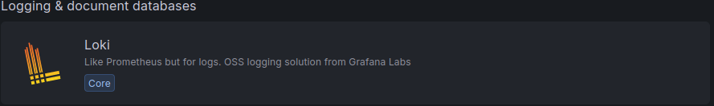
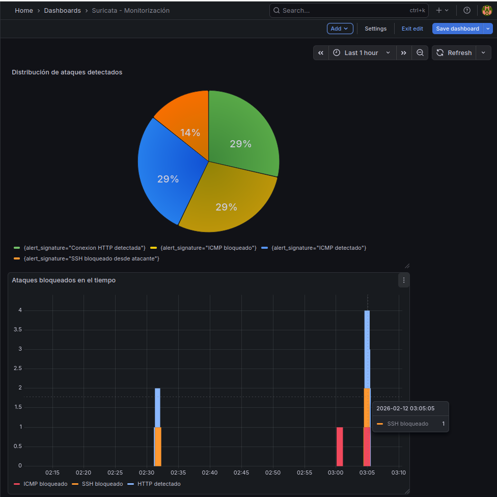

# Implementación NIDS/NIPS con Suricata, Alloy, Loki y Grafana

Laboratorio de seguridad en red donde se implementa un sistema **NIDS/NIPS** con **Suricata**, usando **nftables + NFQUEUE** para el modo IPS y **Alloy, Loki y Grafana** para la recolección y visualización de logs.

## Resumen del proyecto

El objetivo de este proyecto es montar un entorno de laboratorio con tres máquinas virtuales para simular tráfico entre una máquina atacante y una víctima, pasando por un servidor intermedio con Suricata.

La máquina Suricata actúa como router entre dos subredes, analiza el tráfico en modo IDS y posteriormente se configura en modo IPS para bloquear tráfico mediante reglas locales. Finalmente, los eventos generados se envían a Loki mediante Alloy y se visualizan en Grafana mediante dashboards.

## Objetivos

* Crear un laboratorio con tres máquinas virtuales.
* Configurar Suricata como router entre dos redes.
* Activar el reenvío de tráfico entre subredes.
* Implementar Suricata en modo IDS.
* Configurar Suricata en modo IPS usando NFQUEUE.
* Crear reglas locales de alerta y bloqueo.
* Enviar logs de Suricata a Loki mediante Alloy.
* Visualizar eventos y bloqueos en Grafana.
* Documentar pruebas, errores encontrados y soluciones aplicadas.

## Arquitectura del laboratorio

| Máquina  | Rol                                  | Red / IP                              |
| -------- | ------------------------------------ | ------------------------------------- |
| Atacante | Genera tráfico de prueba             | `192.168.40.2/24`                     |
| Suricata | Router + IDS/IPS + monitorización    | `192.168.40.1/24` y `192.168.50.1/24` |
| Víctima  | Recibe tráfico y servicios de prueba | `192.168.50.2/24`                     |

El tráfico entre atacante y víctima pasa por el servidor Suricata, permitiendo analizar, registrar y bloquear conexiones según las reglas configuradas.

## Tecnologías utilizadas

* Ubuntu Server 24.04 LTS
* Suricata
* nftables
* NFQUEUE
* ethtool
* Alloy
* Loki
* Grafana
* ACL
* IsardVDI

## Funcionalidades implementadas

* Enrutamiento entre dos subredes.
* Activación de `ip_forward`.
* Configuración de nftables.
* Desactivación de offloading en interfaces de red.
* Instalación y configuración de Suricata.
* Activación de logs EVE JSON.
* Configuración de Suricata en modo IPS inline.
* Envío de tráfico a NFQUEUE.
* Reglas locales de alerta y bloqueo.
* Pruebas de bloqueo ICMP y SSH.
* Detección de tráfico HTTP.
* Envío de logs a Loki con Alloy.
* Visualización de eventos en Grafana.

## Reglas locales utilizadas

Se configuraron reglas para detectar y bloquear tráfico concreto:

* Alerta ICMP.
* Alerta HTTP.
* Bloqueo ICMP.
* Bloqueo SSH desde la red atacante hacia la red víctima.

Ejemplo de reglas:

```conf
alert icmp any any -> any any (msg:"ICMP detectado"; sid:1000001; rev:1;)
alert tcp any any -> any 80 (msg:"Conexion HTTP detectada"; sid:1000002; rev:1;)

drop icmp any any -> any any (msg:"ICMP bloqueado"; sid:1000003; rev:1;)
drop tcp 192.168.40.0/24 any -> 192.168.50.0/24 22 (msg:"SSH bloqueado desde atacante"; sid:1000004; rev:1;)
```

## Pruebas realizadas

Durante la práctica se realizaron varias comprobaciones:

* Ping entre atacante y víctima antes de activar bloqueos.
* Verificación de conectividad entre subredes.
* Prueba de bloqueo ICMP.
* Prueba de bloqueo SSH.
* Prueba de detección HTTP.
* Revisión de alertas en `fast.log`.
* Revisión de eventos en `eve.json`.
* Visualización de eventos en Grafana.

## Capturas

Las capturas principales se encuentran en la carpeta [`img/`](img/).

Ejemplos:






## Documentación completa

La documentación paso a paso se encuentra en:

[`docs/implementacion-suricata-alloy-loki-grafana.md`](docs/implementacion-suricata-alloy-loki-grafana.md)

Incluye:

* Configuración de máquinas virtuales.
* Configuración de red.
* Instalación de Suricata.
* Paso de IDS a IPS.
* Configuración de NFQUEUE.
* Reglas locales.
* Pruebas de bloqueo.
* Instalación de Alloy, Loki y Grafana.
* Creación de dashboards.
* Problemas encontrados y soluciones aplicadas.

## Problemas encontrados

Durante el laboratorio aparecieron varios problemas reales:

* Suricata seguía arrancando en modo AF-PACKET por la configuración del servicio systemd.
* Fue necesario crear un override del servicio para ejecutar Suricata con NFQUEUE.
* El servicio no arrancaba correctamente hasta indicar la cola con `-q 0`.
* Fue necesario cargar el módulo `nfnetlink_queue`.
* Alloy no podía leer inicialmente el archivo `eve.json`, por lo que se corrigieron permisos con ACL.
* Algunos dashboards iniciales no eran suficientemente claros y se ajustaron para mostrar mejor los eventos.

## Soluciones aplicadas

* Configuración de `ip_forward`.
* Ajuste de nftables para enviar tráfico a NFQUEUE.
* Override del servicio Suricata en systemd.
* Carga del módulo `nfnetlink_queue`.
* Validación de configuración con `suricata -T`.
* Configuración de ACL para permitir lectura de logs a Alloy.
* Configuración de Loki como datasource en Grafana.
* Creación de dashboards para visualizar alertas y bloqueos.

## Resultado final

El laboratorio quedó funcionando con Suricata como IDS/IPS, bloqueando tráfico según reglas locales y enviando eventos a Loki para su visualización en Grafana.

El resultado permite ver de forma gráfica eventos como:

* ICMP bloqueado.
* SSH bloqueado.
* Tráfico HTTP detectado.
* Eventos registrados por Suricata.

## Aprendizajes

Este proyecto me permitió trabajar con conceptos reales de seguridad y monitorización:

* Funcionamiento de un IDS y un IPS.
* Diferencia entre detección y bloqueo.
* Uso de NFQUEUE con nftables.
* Reglas personalizadas en Suricata.
* Logs EVE JSON.
* Recolección de logs con Alloy.
* Almacenamiento de logs en Loki.
* Visualización y análisis en Grafana.
* Resolución de errores de servicios systemd.
* Documentación técnica de un laboratorio de ciberseguridad.
