# Implementación NIDS/NIPS con Suricata, Alloy, Loki y Grafana

## 1. Objetivo del proyecto

El objetivo de esta práctica es montar un laboratorio de seguridad en red con **Suricata** funcionando primero como **IDS** y después como **IPS**, utilizando **nftables + NFQUEUE** para inspeccionar y bloquear tráfico entre dos subredes.

Además, se configura una pila de monitorización formada por **Alloy, Loki y Grafana** para recoger los logs generados por Suricata y visualizarlos de una forma más clara mediante dashboards.

La idea general del montaje es que todo el tráfico entre la máquina atacante y la máquina víctima pase obligatoriamente por la máquina Suricata. De esta forma, Suricata puede detectar conexiones, generar alertas y bloquear tráfico concreto según las reglas configuradas.

---

## 2. Arquitectura del laboratorio

Para la práctica se utilizan **tres máquinas virtuales** en IsardVDI, todas con **Ubuntu 24.04 LTS**.

| Máquina | Rol | Red atacante | Red víctima | Función |
|---|---|---:|---:|---|
| `dosorio-atacante` | Atacante | `192.168.40.2/24` | - | Genera tráfico hacia la víctima |
| `dosorio-suricata` | Router + IDS/IPS | `192.168.40.1/24` | `192.168.50.1/24` | Enruta, analiza y bloquea tráfico |
| `dosorio-victima` | Víctima | - | `192.168.50.2/24` | Recibe tráfico y servicios de prueba |

Esquema lógico del laboratorio:

```text
Atacante              Suricata / Router / IPS              Víctima
192.168.40.2  --->   192.168.40.1 | 192.168.50.1   --->   192.168.50.2
```

La máquina Suricata tiene una interfaz en cada red, por lo que actúa como punto intermedio entre ambas subredes.

---

## 3. Máquinas virtuales y configuración de red

### 3.1 Máquina atacante

La máquina atacante se utiliza para generar tráfico hacia la red víctima y comprobar si Suricata lo detecta o lo bloquea.

**Nombre:** `dosorio-atacante`  
**Sistema operativo:** Ubuntu 24.04 LTS  
**Recursos asignados:** 5 GB de RAM y 3 CPU

Interfaces de red:

- `enp1s0`: Default, con DHCP.
- `enp2s0`: WireGuard VPN, con DHCP.
- `enp3s0`: Red atacante, IP estática `192.168.40.2/24`.

Configuración Netplan:

```yaml
network:
  ethernets:
    enp1s0:
      dhcp4: true
    enp2s0:
      dhcp4: true
    enp3s0:
      dhcp4: false
      addresses: [192.168.40.2/24]
      routes:
        - to: 192.168.50.0/24
          via: 192.168.40.1
  version: 2
```

La ruta estática permite que la máquina atacante sepa que para llegar a la red `192.168.50.0/24` debe enviar el tráfico a través de la máquina Suricata.

---

### 3.2 Máquina Suricata

Esta máquina es el elemento principal de la práctica. Actúa como router entre las dos redes y también como IDS/IPS.

**Nombre:** `dosorio-suricata`  
**Sistema operativo:** Ubuntu 24.04 LTS  
**Recursos asignados:** 6 GB de RAM y 3 CPU

Interfaces de red:

- `enp1s0`: Default, con DHCP.
- `enp2s0`: WireGuard VPN, con DHCP.
- `enp3s0`: Red atacante, IP `192.168.40.1/24`.
- `enp4s0`: Red víctima, IP `192.168.50.1/24`.

Configuración Netplan:

```yaml
network:
  ethernets:
    enp1s0:
      dhcp4: true
    enp2s0:
      dhcp4: true
    enp3s0:
      dhcp4: false
      addresses: [192.168.40.1/24]
    enp4s0:
      dhcp4: false
      addresses: [192.168.50.1/24]
  version: 2
```

---

### 3.3 Máquina víctima

La máquina víctima se utiliza para recibir el tráfico generado por el atacante y comprobar el comportamiento de Suricata.

**Nombre:** `dosorio-victima`  
**Sistema operativo:** Ubuntu 24.04 LTS  
**Recursos asignados:** 5 GB de RAM y 2 CPU

Interfaces de red:

- `enp1s0`: Default, con DHCP.
- `enp2s0`: WireGuard VPN, con DHCP.
- `enp3s0`: Red víctima, IP `192.168.50.2/24`.

Configuración Netplan:

```yaml
network:
  ethernets:
    enp1s0:
      dhcp4: true
    enp2s0:
      dhcp4: true
    enp3s0:
      dhcp4: false
      addresses: [192.168.50.2/24]
      routes:
        - to: 192.168.40.0/24
          via: 192.168.50.1
  version: 2
```

La ruta estática permite que la víctima responda correctamente al tráfico procedente de la red atacante.

---

## 4. Configuración de Suricata como router

Para que la máquina Suricata pueda reenviar paquetes entre las dos redes, es necesario activar el **IP forwarding** en Linux.

Se edita el archivo:

```bash
sudo nano /etc/sysctl.conf
```

Y se activa la siguiente línea:

```conf
net.ipv4.ip_forward=1
```

Después se aplican los cambios:

```bash
sudo sysctl -p
```

Salida esperada:

```text
net.ipv4.ip_forward = 1
```

Con esto, la máquina Suricata ya puede actuar como router entre `192.168.40.0/24` y `192.168.50.0/24`.

---

## 5. Activación de nftables

Para gestionar el filtrado y el envío de tráfico hacia NFQUEUE se utiliza **nftables**.

Primero se habilita el servicio:

```bash
sudo systemctl enable nftables
```

Después se comprueba el estado:

```bash
systemctl status nftables
```

Salida esperada:

```text
● nftables.service - nftables
     Loaded: loaded
     Active: active (exited)
```

Con esto queda preparado nftables para cargar reglas de filtrado y reenvío de tráfico.

---

## 6. Ajustes de offloading con ethtool

En entornos IDS/IPS es recomendable desactivar algunas funciones de offloading de las tarjetas de red virtuales. Esto ayuda a evitar comportamientos extraños relacionados con checksums, segmentación y paquetes que Suricata podría no analizar como se espera.

Se instala `ethtool`:

```bash
sudo apt install -y ethtool
```

Y se desactivan opciones de offloading en las interfaces internas:

```bash
sudo ethtool -K enp3s0 gro off lro off gso off tso off
sudo ethtool -K enp4s0 gro off lro off gso off tso off
```

Esto ayuda a que Suricata analice el tráfico de forma más fiable.

---

## 7. Verificación de conectividad inicial

Antes de instalar y configurar Suricata, se comprueba que las máquinas tienen conectividad entre ellas a través del router.

### 7.1 Ping desde atacante a víctima

Desde la máquina atacante:

```bash
ping 192.168.50.2
```

Salida esperada:

```text
PING 192.168.50.2 (192.168.50.2) 56(84) bytes of data.
64 bytes from 192.168.50.2: icmp_seq=1 ttl=63 time=15.7 ms
64 bytes from 192.168.50.2: icmp_seq=2 ttl=63 time=4.18 ms

--- 192.168.50.2 ping statistics ---
2 packets transmitted, 2 received, 0% packet loss
```

### 7.2 Ping desde víctima a atacante

Desde la máquina víctima:

```bash
ping 192.168.40.2
```

Salida esperada:

```text
PING 192.168.40.2 (192.168.40.2) 56(84) bytes of data.
64 bytes from 192.168.40.2: icmp_seq=1 ttl=63 time=3.47 ms

--- 192.168.40.2 ping statistics ---
1 packets transmitted, 1 received, 0% packet loss
```

Con estas pruebas se confirma que el enrutamiento básico funciona correctamente.

---

## 8. Instalación de Suricata en modo IDS

Se instala Suricata y la herramienta de actualización de reglas:

```bash
sudo apt install suricata suricata-update
```

Después se actualizan las reglas disponibles:

```bash
sudo suricata-update
```

En esta primera fase, Suricata se configura como **IDS**, es decir, detecta tráfico y genera alertas, pero todavía no bloquea paquetes.

---

## 9. Configuración principal de Suricata

El archivo principal de configuración es:

```bash
sudo nano /etc/suricata/suricata.yaml
```

### 9.1 Definición de HOME_NET

Dentro del apartado `vars`, se define `HOME_NET` con las dos redes internas del laboratorio:

```yaml
vars:
  address-groups:
    HOME_NET: "[192.168.40.0/24,192.168.50.0/24]"
    EXTERNAL_NET: "!$HOME_NET"
```

Esto es importante porque Suricata necesita saber qué redes forman parte del entorno interno para clasificar correctamente el tráfico.

---

### 9.2 Activación de logs EVE JSON

Para poder enviar logs a Loki más adelante, se activa la salida en formato **EVE JSON**.

En el apartado `outputs` se deja configurado:

```yaml
outputs:
  - fast:
      enabled: yes
      filename: fast.log
      append: yes

  - eve-log:
      enabled: yes
      filetype: regular
      filename: /var/log/suricata/eve.json
```

El archivo `fast.log` permite ver alertas de forma rápida en texto plano. El archivo `eve.json` contiene eventos en JSON y será el que se enviará a Loki mediante Alloy.

---

### 9.3 Validación de configuración

Después de modificar la configuración, se valida con:

```bash
sudo suricata -T -c /etc/suricata/suricata.yaml
```

Salida esperada:

```text
Configuration provided was successfully loaded. Exiting.
```

---

### 9.4 Reinicio del servicio

Se reinicia Suricata:

```bash
sudo systemctl restart suricata
```

Y se comprueba el estado:

```bash
systemctl status suricata
```

Salida esperada:

```text
● suricata.service - Suricata IDS/IDP daemon
     Loaded: loaded
     Active: active (running)
```

Con esto Suricata queda funcionando como IDS.

---

## 10. Paso de IDS a IPS con NFQUEUE

Una vez comprobado que Suricata funciona como IDS, se configura como **IPS** para que pueda bloquear tráfico.

Para ello se utiliza **NFQUEUE**, que permite que nftables envíe paquetes a una cola del kernel y que Suricata decida si los acepta o los descarta.

---

### 10.1 Configuración de NFQUEUE en Suricata

Se edita de nuevo:

```bash
sudo nano /etc/suricata/suricata.yaml
```

Se añade o revisa la configuración:

```yaml
nfqueue:
  - id: 0
    mode: accept
    fail-open: yes
```

Esta configuración indica que Suricata usará la cola `0` de NFQUEUE.

El parámetro `fail-open: yes` permite que, si Suricata falla, el tráfico pueda seguir pasando. En un laboratorio esto es útil para evitar dejar las máquinas sin conectividad mientras se prueba la configuración.

---

### 10.2 Problema con el servicio systemd

Al intentar reiniciar Suricata en modo NFQUEUE apareció un problema: el servicio seguía arrancando con parámetros de **AF-PACKET**, porque el `ExecStart` original del servicio forzaba ese modo de captura.

El error principal era que Suricata no arrancaba correctamente al mezclar el modo configurado en `suricata.yaml` con el modo forzado por systemd.

---

### 10.3 Override del servicio Suricata

Para corregirlo, se creó un override del servicio systemd.

Primero se modificó el `ExecStart`:

```bash
sudo tee /etc/systemd/system/suricata.service.d/override.conf >/dev/null <<'EOF'
[Service]
ExecStart=
ExecStart=/usr/bin/suricata -D -c /etc/suricata/suricata.yaml --pidfile /run/suricata.pid
EOF
```

Después se añadió el parámetro `-q 0`, indicando explícitamente que Suricata debía usar la cola 0 de NFQUEUE:

```bash
sudo tee /etc/systemd/system/suricata.service.d/override.conf >/dev/null <<'EOF'
[Service]
ExecStart=
ExecStart=/usr/bin/suricata -D -c /etc/suricata/suricata.yaml -q 0 --runmode autofp --pidfile /run/suricata.pid
EOF
```

---

### 10.4 Carga del módulo nfnetlink_queue

Para que NFQUEUE funcione, se cargó el módulo del kernel necesario:

```bash
sudo modprobe nfnetlink_queue
```

---

### 10.5 Recarga de systemd y reinicio

Después de modificar el servicio:

```bash
sudo systemctl daemon-reload
sudo systemctl reset-failed suricata
sudo systemctl restart suricata
```

Se comprobó el estado:

```bash
systemctl status suricata
```

Salida esperada:

```text
● suricata.service - Suricata IDS/IDP daemon
     Drop-In: /etc/systemd/system/suricata.service.d
              └─override.conf
     Active: active (running)
```

Con esto Suricata queda arrancando en modo inline con NFQUEUE.

---

## 11. Configuración de nftables para NFQUEUE

Una vez Suricata está preparado para trabajar con NFQUEUE, se configura nftables para enviar el tráfico entre las dos redes a la cola 0.

Se edita:

```bash
sudo nano /etc/nftables.conf
```

Contenido del archivo:

```conf
#!/usr/sbin/nft -f
flush ruleset

table inet filter {
    chain input {
        type filter hook input priority 0;
        policy accept;
    }

    chain forward {
        type filter hook forward priority 0;
        policy accept;

        # Tráfico desde la red atacante hacia la red víctima
        ip saddr 192.168.40.0/24 ip daddr 192.168.50.0/24 counter queue num 0

        # Tráfico desde la red víctima hacia la red atacante
        ip saddr 192.168.50.0/24 ip daddr 192.168.40.0/24 counter queue num 0
    }
}
```

Se aplican las reglas:

```bash
sudo nft -f /etc/nftables.conf
```

Y se comprueban:

```bash
sudo nft list ruleset
```

Salida esperada:

```text
table inet filter {
    chain input {
        type filter hook input priority filter; policy accept;
    }

    chain forward {
        type filter hook forward priority filter; policy accept;
        ip saddr 192.168.40.0/24 ip daddr 192.168.50.0/24 counter queue to 0
        ip saddr 192.168.50.0/24 ip daddr 192.168.40.0/24 counter queue to 0
    }
}
```

Con esta configuración, el tráfico entre las dos redes pasa por NFQUEUE y Suricata puede tomar decisiones sobre él.

---

## 12. Verificación de conectividad con NFQUEUE activo

Antes de crear reglas de bloqueo, se comprueba que sigue existiendo conectividad.

Desde el atacante:

```bash
ping 192.168.50.2
```

Salida esperada:

```text
64 bytes from 192.168.50.2: icmp_seq=1 ttl=63 time=24.6 ms
64 bytes from 192.168.50.2: icmp_seq=2 ttl=63 time=3.10 ms

--- 192.168.50.2 ping statistics ---
2 packets transmitted, 2 received, 0% packet loss
```

Esto confirma que NFQUEUE está activo y que Suricata está dejando pasar el tráfico porque todavía no hay reglas de bloqueo aplicadas.

---

## 13. Reglas locales de Suricata

Se editan las reglas locales:

```bash
sudo nano /etc/suricata/rules/local.rules
```

Contenido añadido:

```conf
# ALERTAS
alert icmp any any -> any any (msg:"ICMP detectado"; sid:1000001; rev:1;)
alert tcp any any -> any 80 (msg:"Conexion HTTP detectada"; sid:1000002; rev:1;)

# BLOQUEOS
drop icmp any any -> any any (msg:"ICMP bloqueado"; sid:1000003; rev:1;)
drop tcp 192.168.40.0/24 any -> 192.168.50.0/24 22 (msg:"SSH bloqueado desde atacante"; sid:1000004; rev:1;)
```

Estas reglas permiten comprobar tanto la detección como el bloqueo de tráfico.

---

## 14. Inclusión de local.rules en suricata.yaml

Primero se comprueba si `local.rules` ya está incluido:

```bash
sudo grep -n "local.rules" /etc/suricata/suricata.yaml
```

Si no devuelve resultado, se añade en `suricata.yaml`:

```yaml
default-rule-path: /etc/suricata/rules

rule-files:
  - local.rules
```

Después se vuelve a comprobar:

```bash
sudo grep -n "local.rules" /etc/suricata/suricata.yaml
```

Salida esperada:

```text
2153:  - local.rules
```

---

## 15. Validación de reglas

Se valida que Suricata carga correctamente las reglas:

```bash
sudo suricata -T -c /etc/suricata/suricata.yaml -v
```

Salida esperada:

```text
1 rule files processed. 4 rules successfully loaded, 0 rules failed
4 signatures processed
Configuration provided was successfully loaded. Exiting.
```

Después se reinicia Suricata:

```bash
sudo systemctl restart suricata
```

Y se comprueba el estado:

```bash
systemctl status suricata
```

---

## 16. Pruebas de bloqueo y detección

### 16.1 Prueba de ICMP bloqueado

Desde el atacante:

```bash
ping 192.168.50.2
```

Resultado:

```text
--- 192.168.50.2 ping statistics ---
18 packets transmitted, 0 received, 100% packet loss
```

Se revisa el log de Suricata:

```bash
sudo tail -f /var/log/suricata/fast.log
```

Salida esperada:

```text
[Drop] [**] [1:1000003:1] ICMP bloqueado [**] {ICMP} 192.168.40.2:8 -> 192.168.50.2:0
[**] [1:1000001:1] ICMP detectado [**] {ICMP} 192.168.40.2:8 -> 192.168.50.2:0
```

Con esto se comprueba que Suricata detecta y bloquea ICMP.

---

### 16.2 Prueba de SSH bloqueado

Desde el atacante:

```bash
ssh usuario@192.168.50.2
```

Resultado:

```text
ssh: connect to host 192.168.50.2 port 22: Connection timed out
```

Se revisa el log:

```bash
sudo tail -f /var/log/suricata/fast.log
```

Salida esperada:

```text
[Drop] [**] [1:1000004:1] SSH bloqueado desde atacante [**] {TCP} 192.168.40.2:39040 -> 192.168.50.2:22
```

Con esto se comprueba que el bloqueo de SSH funciona.

---

### 16.3 Prueba de HTTP detectado

Desde el atacante:

```bash
curl http://192.168.50.2
```

Resultado posible:

```text
curl: (7) Failed to connect to 192.168.50.2 port 80
```

Se revisa el log:

```bash
sudo tail -f /var/log/suricata/fast.log
```

Salida esperada:

```text
[**] [1:1000002:1] Conexion HTTP detectada [**] {TCP} 192.168.40.2:48754 -> 192.168.50.2:80
```

Con estas pruebas se confirma que las reglas locales se están aplicando correctamente.

---

## 17. Instalación de Alloy, Loki y Grafana

Una vez Suricata genera logs correctamente, se configura una pila de monitorización para visualizarlos.

Componentes utilizados:

- **Alloy:** recolector encargado de leer `eve.json` y enviar los eventos a Loki.
- **Loki:** sistema de almacenamiento y consulta de logs.
- **Grafana:** herramienta de visualización para crear dashboards.

---

## 18. Instalación de Alloy

Se instala `gpg`:

```bash
sudo apt install gpg
```

Se añade la clave GPG del repositorio de Grafana:

```bash
wget -q -O - https://apt.grafana.com/gpg.key | gpg --dearmor | sudo tee /usr/share/keyrings/grafana.gpg > /dev/null
```

Se añade el repositorio:

```bash
echo "deb [signed-by=/usr/share/keyrings/grafana.gpg] https://apt.grafana.com stable main" | sudo tee /etc/apt/sources.list.d/grafana.list
```

Se actualizan paquetes:

```bash
sudo apt update
```

Se instala Alloy:

```bash
sudo apt install alloy
```

---

## 19. Instalación y activación de Grafana

Se instala Grafana:

```bash
sudo apt install grafana
```

Se habilita y arranca el servicio:

```bash
sudo systemctl enable grafana-server
sudo systemctl start grafana-server
```

Se comprueba el estado:

```bash
systemctl status grafana-server
```

Grafana queda disponible en el puerto `3000`.

---

## 20. Instalación y configuración de Loki

Se instala Loki:

```bash
sudo apt install loki
```

Se edita la configuración:

```bash
sudo nano /etc/loki/config.yml
```

Configuración básica:

```yaml
server:
  http_listen_port: 3100
  grpc_listen_port: 9096
```

Se reinicia el servicio:

```bash
sudo systemctl restart loki
```

Y se comprueba:

```bash
systemctl status loki
```

Salida esperada:

```text
● loki.service - Loki service
     Active: active (running)
```

---

## 21. Configuración de Alloy para enviar logs a Loki

Se edita el archivo de configuración de Alloy:

```bash
sudo nano /etc/alloy/config.alloy
```

Contenido utilizado:

```alloy
loki.write "default" {
  endpoint {
    url = "http://127.0.0.1:3100/loki/api/v1/push"
  }
}

loki.source.file "suricata" {
  targets = [
    {
      __path__ = "/var/log/suricata/eve.json",
      job      = "suricata-logs",
      host     = "dosorio-suricata",
      source   = "evejson",
    },
  ]

  forward_to = [loki.write.default.receiver]
}
```

Se reinicia Alloy:

```bash
sudo systemctl restart alloy
```

---

## 22. Permisos para que Alloy lea eve.json

Alloy necesita permisos de lectura sobre el archivo de logs de Suricata.

Se instala soporte ACL:

```bash
sudo apt install -y acl
```

Se conceden permisos:

```bash
sudo setfacl -m u:alloy:r /var/log/suricata/eve.json
sudo setfacl -m u:alloy:rx /var/log/suricata
```

Con esto, Alloy puede leer `eve.json` y enviar los eventos a Loki.

---

## 23. Acceso a Grafana

Se accede desde el navegador:

```text
http://192.168.50.1:3000
```


En el primer inicio de sesión se utilizan las credenciales por defecto:

```text
Usuario: admin
Contraseña: admin
```

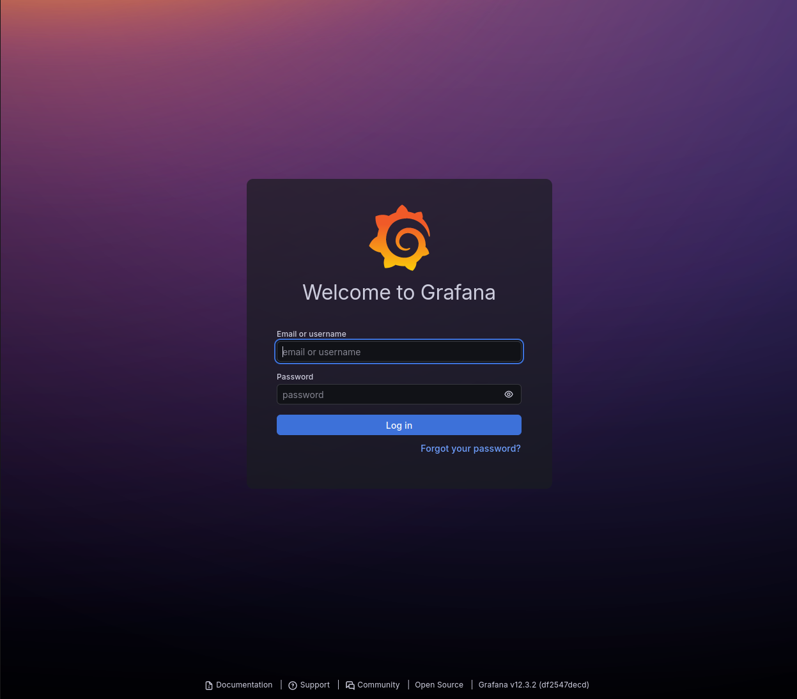

Después del primer inicio de sesión, Grafana solicita cambiar la contraseña inicial. En este punto se configuró una nueva contraseña segura para no mantener las credenciales por defecto.

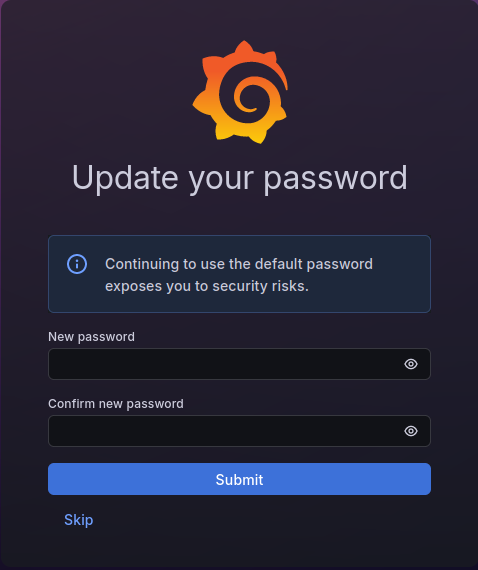

Tras acceder, se muestra el panel principal de Grafana.

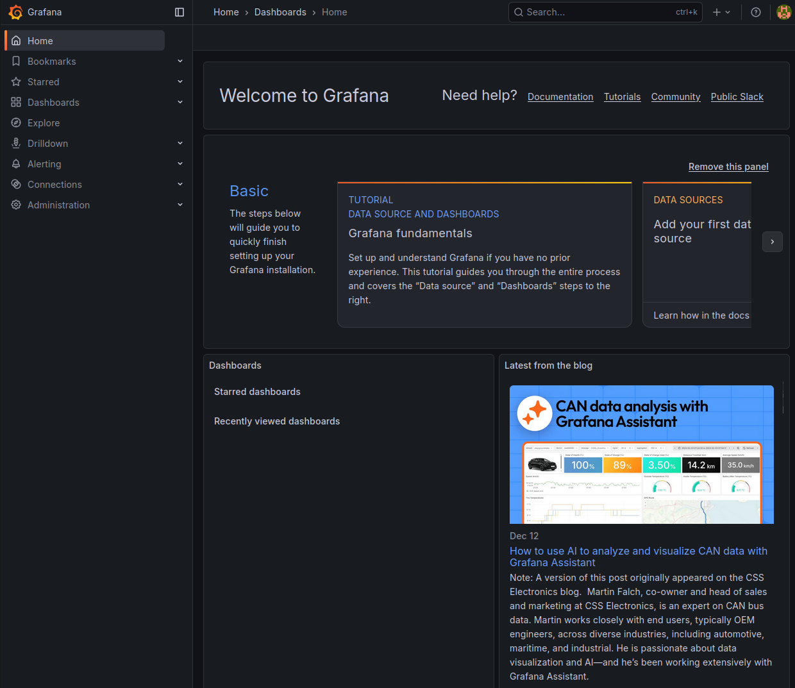

---

## 24. Configuración de Loki como Data Source en Grafana

En Grafana se accede al apartado de conexiones y fuentes de datos.

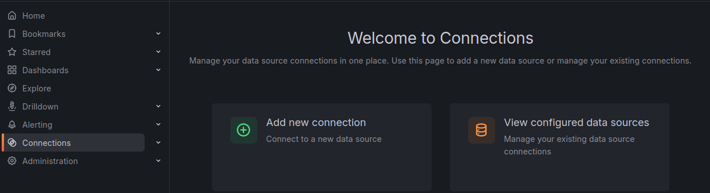

Se selecciona la opción para añadir una nueva fuente de datos.

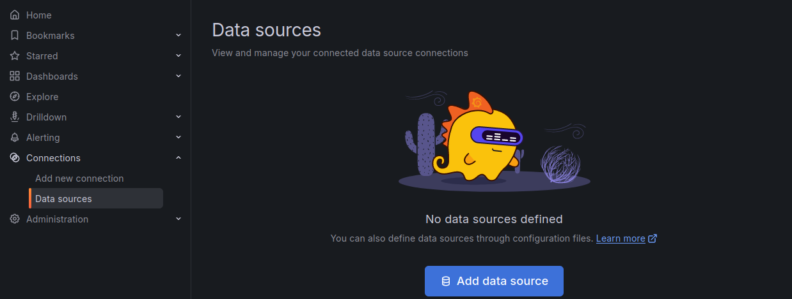

Se elige Loki como datasource.

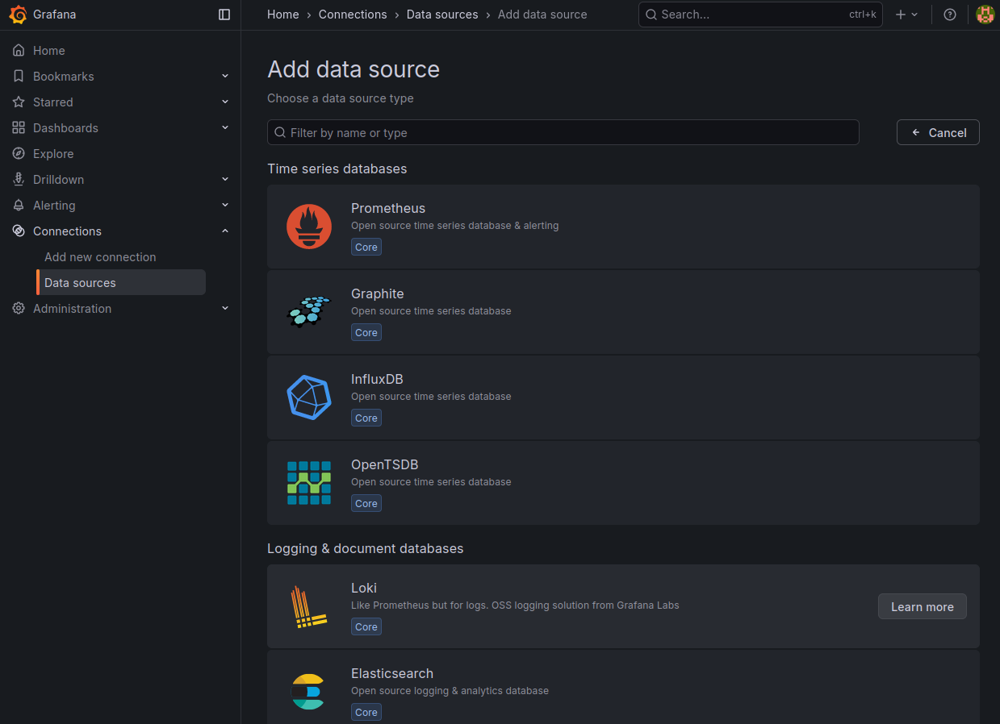

En la configuración de Loki se indica la URL del servicio:

```text
http://localhost:3100
```


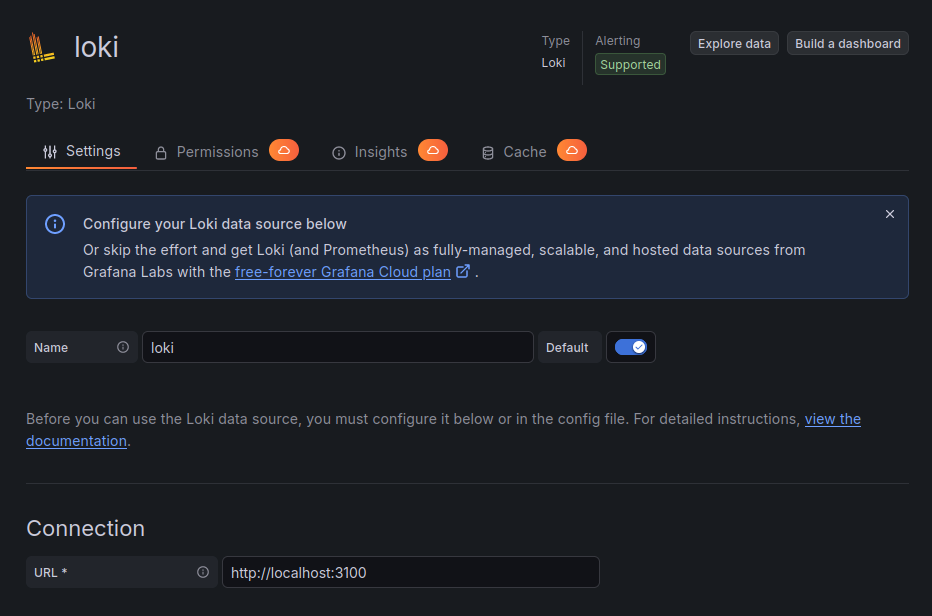

Se revisa la configuración final y se guarda.


La prueba con **Save & Test** confirma que Grafana puede comunicarse correctamente con Loki.


---

## 25. Creación de dashboard en Grafana

Con Loki configurado, se crea un dashboard para visualizar los eventos generados por Suricata.

Desde el menú lateral se accede a dashboards.

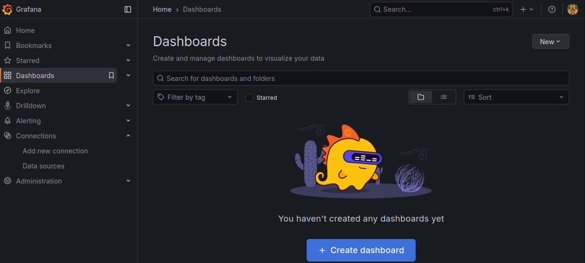

Se crea un nuevo dashboard.

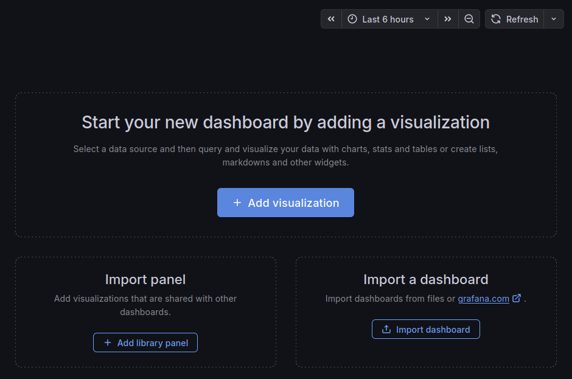

Después se añade una visualización.

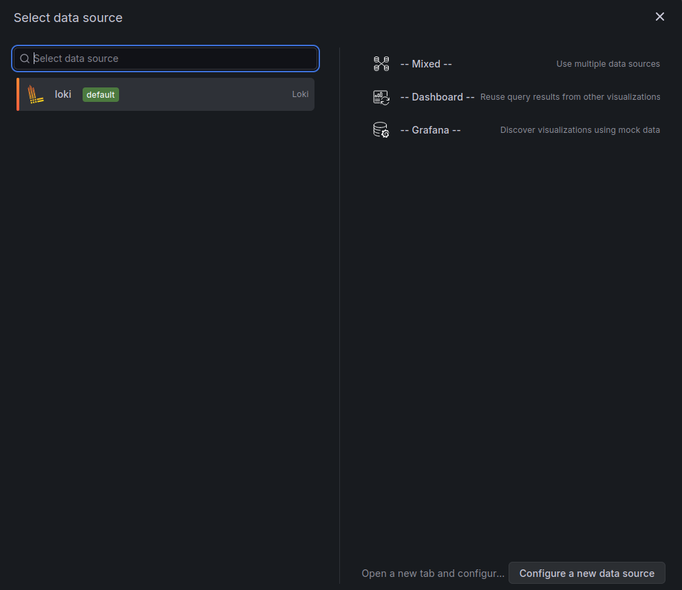

Se selecciona Loki como origen de datos para las consultas.

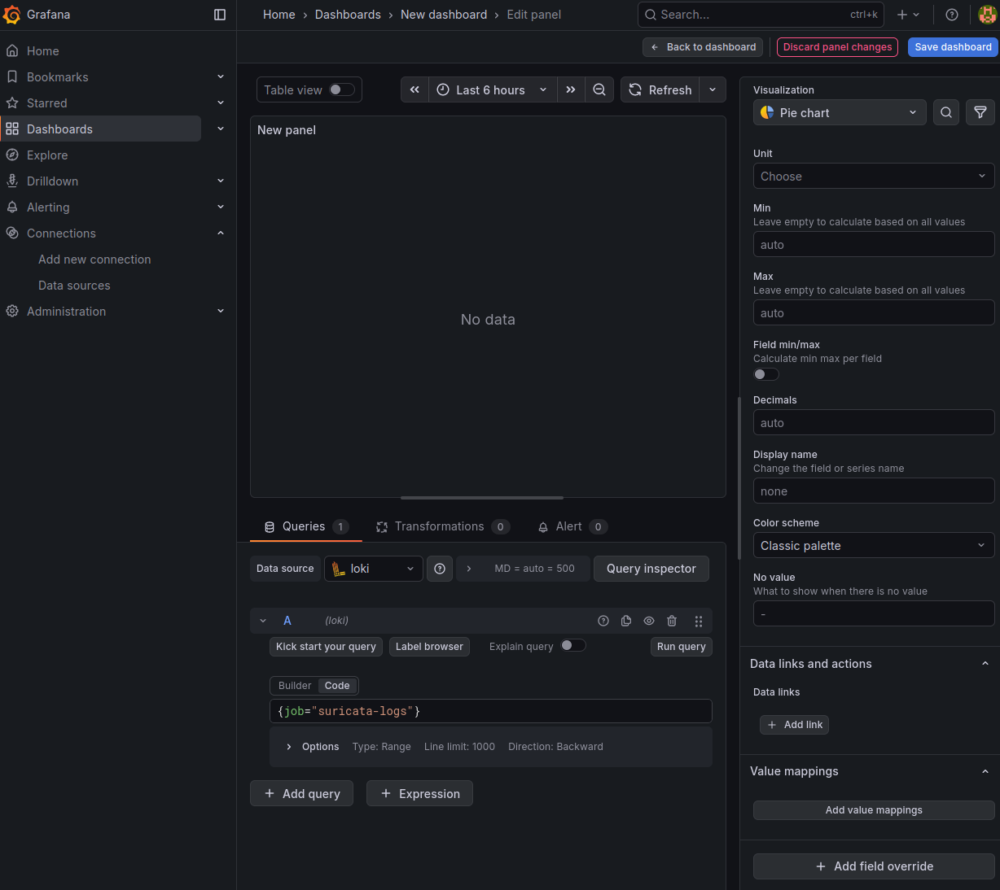

Se configura el panel de visualización para mostrar eventos de Suricata.

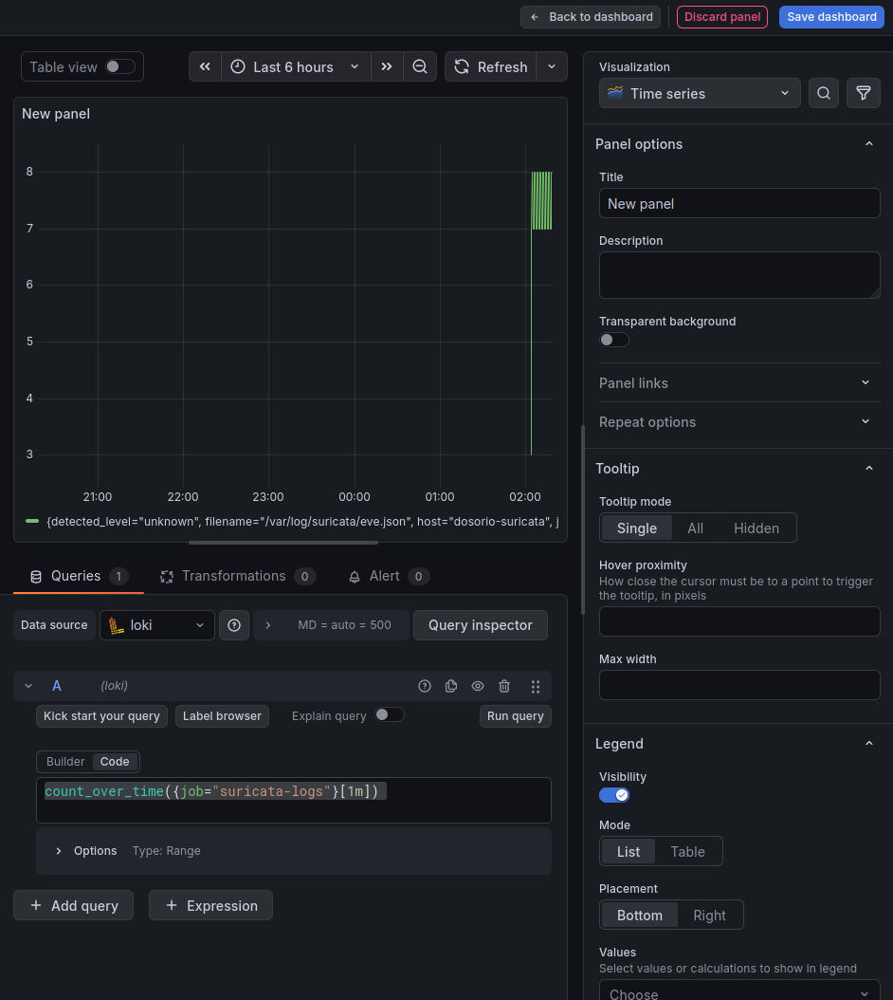

Una vez guardado, el dashboard aparece en la lista.

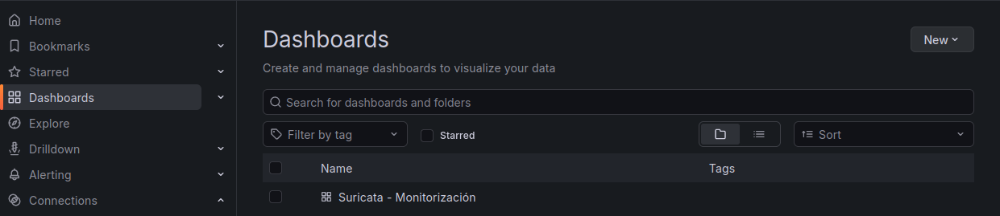

Al abrirlo, se visualizan eventos generados por Suricata.

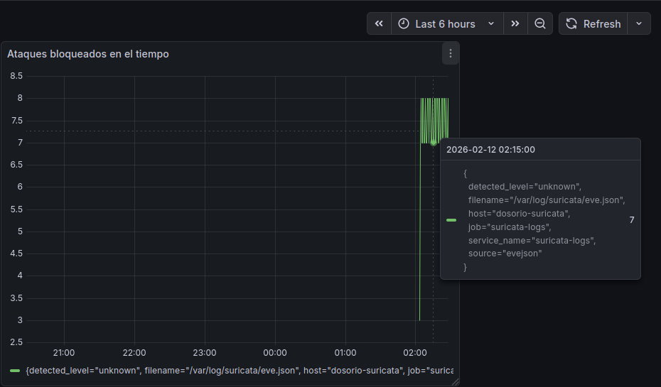

Después de ajustar los paneles, el dashboard final queda más claro y permite diferenciar mejor los eventos detectados y bloqueados.


---

## 26. Problemas encontrados y soluciones aplicadas

### Problema 1: Suricata seguía arrancando en modo AF-PACKET

El servicio original de Suricata forzaba el uso de AF-PACKET en el `ExecStart`, lo que impedía trabajar correctamente con NFQUEUE.

**Solución aplicada:**  
Se creó un override del servicio systemd para eliminar el `ExecStart` original y ejecutar Suricata con la cola NFQUEUE.

---

### Problema 2: Suricata no arrancaba sin indicar la cola

Aunque se había configurado NFQUEUE en `suricata.yaml`, el servicio no arrancaba correctamente hasta indicar la cola explícitamente.

**Solución aplicada:**  
Se añadió el parámetro:

```bash
-q 0
```

al `ExecStart` del servicio.

---

### Problema 3: faltaba el módulo nfnetlink_queue

NFQUEUE necesita el módulo `nfnetlink_queue` cargado en el kernel.

**Solución aplicada:**

```bash
sudo modprobe nfnetlink_queue
```

---

### Problema 4: Alloy no podía leer eve.json

El usuario del servicio Alloy no tenía permisos suficientes para leer `/var/log/suricata/eve.json`.

**Solución aplicada:**  
Se instalaron ACL y se dieron permisos concretos al usuario `alloy`.

```bash
sudo setfacl -m u:alloy:r /var/log/suricata/eve.json
sudo setfacl -m u:alloy:rx /var/log/suricata
```

---

### Problema 5: dashboard inicial poco claro

El primer dashboard mostraba información, pero no era suficientemente intuitivo.

**Solución aplicada:**  
Se mejoraron los paneles para que los eventos se vieran de forma más clara, diferenciando mejor alertas y bloqueos.

---

## 27. Comprobaciones finales

Al finalizar la práctica se comprobaron los siguientes puntos:

- El servidor Suricata enruta correctamente entre ambas redes.
- `ip_forward` está activo.
- nftables está activo.
- El tráfico entre redes pasa por NFQUEUE.
- Suricata arranca correctamente con `-q 0`.
- La configuración de Suricata carga sin errores.
- Las reglas locales se cargan correctamente.
- ICMP queda bloqueado.
- SSH queda bloqueado desde la red atacante.
- HTTP queda registrado como alerta.
- Los logs se generan en `fast.log` y `eve.json`.
- Alloy puede leer `eve.json`.
- Loki recibe los logs.
- Grafana se conecta correctamente a Loki.
- El dashboard muestra eventos de Suricata.

---

## 28. Resultado final

El laboratorio queda funcionando con Suricata como sistema IDS/IPS. Primero se comprueba la detección de tráfico y después se activa el modo IPS mediante NFQUEUE para bloquear tráfico concreto.

La integración con Alloy, Loki y Grafana permite visualizar los eventos de Suricata de forma gráfica, haciendo más fácil analizar alertas, bloqueos y actividad entre las dos redes.

El resultado final es un entorno de laboratorio completo para practicar conceptos de seguridad en red, detección, prevención, logs y monitorización.
